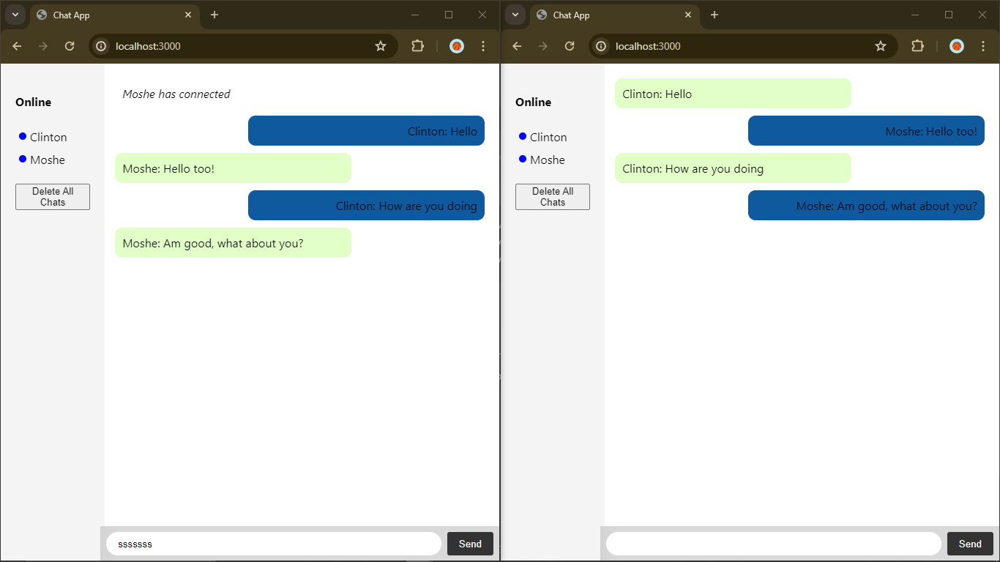

# Real-time Chat Application

A simple real-time chat application using Node.js, Express, Socket.io, and SQLite.

## Features

- Real-time messaging
- Nickname support
- "User is typing" functionality
- Online users list with active status indicator
- Delete all chats functionality
- search for messages.
- Upload display picture.

## Screenshot



## Getting Started

### Prerequisites

- Node.js
- npm (Node Package Manager)
- Golang

### Installation

1. Clone the repository:

```bash
git clone https://github.com/clinton-mwachia/socketio-chat-app.git
```

## [Javascript]

2. Change directory

```
cd socketio-chat-app/Javascript
```

3. Install dependencies:

```bash
npm install
```

4. Start the application:

```bash
node index.js
```

5. Open your browser and navigate to `http://localhost:3000`

## [Go]

6. Change directory

```
cd socketio-chat-app/Go
```

7. Install dependencies:

```bash
go mod tidy
```

8. Start the application:

```bash
go run main.go
```

9. Open your browser and navigate to `http://localhost:8000`


## Usage

- Enter your nickname when prompted.
- Type your message and press "Send" or hit enter.
- See who’s online in the sidebar.
- A blue dot indicates active users.
- Click "Delete All Chats" to clear all messages.

## Project Structure

```plaintext
Javascript
    ├── index.js              # Main server-side application file
    ├── public/index.html     # Main client-side HTML file
    ├── public/styles.css     # Client-side CSS file
    ├── package.json          # NPM package configuration file
    └── README.md             # This README file
Go
    ├── main.go               # Main server-side application file
```

## Code Highlights

### Server-Side Code

- Handling connections and disconnections
- Storing and retrieving messages from SQLite database
- Emitting events for real-time updates

### Client-Side Code

- Capturing user inputs and sending messages
- Updating the user interface in real-time
- Handling online users list and status indicators

## License

This project is licensed under the MIT License.


